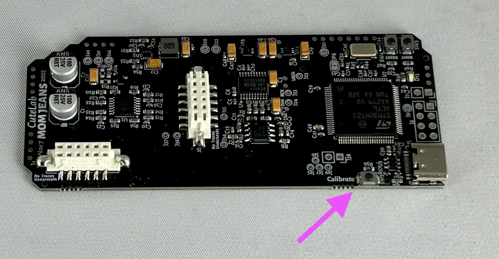

# momjeans-diy
These are the build instructions for the [Mom Jeans DIY kit](https://shop.cutelab.nyc/kits/mom-jeans-diy-kit/).


Your kit should contain:

- 1x PCB "mcu" layer
- 1x PCB "control" layer
- 1x front panel
- 1x 2x5 2.54mm pin header
- 2x 2x6 2mm locking pin headers
- 2x 2x6 2mm locking pin sockets
- 2x SPDT toggle switches
- 1x pushbutton LED switch
- 5x 9mm D-shaft potentiometer
- 5x washers & hex nuts for potentiometer
- 10x PJ398 jacks ("Thonkiconn")
- 10x round nuts for jack 
- 1x blue LED
- 1x skirted knob
- 4x unskirted potentiometer knob
- 1x light blue knob cap
- 2x light white knob cap
- 2x light black knob cap
- 1x ribbon cable

> [!NOTE]
> The rear PCB (the little one) may come with the locking pin sockets pre-soldered. If so, you won't find it in the parts bag.


## Building

### 1. Interconnect pin sockets.

> [!NOTE]
> If the rear PCB is pre-soldered, so you can skip this step.

Start with the smaller PCB and the two white pin sockets.

Both sides have a thin ridge in the plastic casing, but only one side has two thin lines in the ridge.

The pin sockets are locking, and have polarity. Those thin lines must fit into the black shrouded headers in step 3.

Make sure the side with the two thin lines is facing towards the top of the PCB.


### 2. Interconnect pin headers.

Next, take the two black shrouded pin headers.

Before soldering, push them onto the sockets on the bottom board. This will ensure the PCBs are properly aligned.


### 3. Solder the power header.

> [!IMPORTANT]
> Make sure to solder the pin header on the correct side.

The power header is the straight connector with 10 positions (two rows of five). The pins are spaced 2.54mm apart.


### 4. Fit the pushbutton switches.

> [!IMPORTANT]
> Be careful of orientiaton! These switches include an LED, which has a polarity!

This switch has a "keyed" bottom, with two small circles on one side and a square on the other side. These fit into corresponding holes on the PCB, ensuring the switch fits flush with the panel. Make sure that these extrusions fit fully into the PCB.

The switch also has one pin marked in blue, to show the internal LEDs polarity. But you can ignore this. So long as the keyed bottom is inserted correctly, you can feel assured that the LED orientation is correct.

The switch should stay in place on their own, from the pressure of the pins. We recommend that you don't solder any pins until the panel is fitted, to make sure the button fits correctly.


### 5A. Prep the pots.

First, remove any washers and nuts that may be screwed onto the pots.

On the potentiometer, there may be a small stability pin on top. If so, use a pair of pliers to trim it off.  Make sure it's entirely removed, so the panel can sit flat against the pot. Otherwise it can cause other components to be mis-aligned.

### 5B. Fit the pots.

The potentiometers have five pins. The three pins in a row are the ones used for the circuit (the resistance between the pins changes as the pot is turned). The two kinked pins are "mounting" pins, used for physical stability and grounding. If the mounting pins aren't soldered, the pot could cause buzzing every time it's touched.

A small amount force may be necessary when inserting the pot. This is because the mounting pins need to snap into place. You can bend the mounting pins slightly to ensure they fit, but don't straighten them out. They will make assembly easier by holding the pot in position.

As with the button, you can solder one leg of each pot if you like. However, do not solder all pins until later (when the panel is added), or they could turn out very crooked.

### 6. Fit the toggle switches.

These toggle switches have no polarity.

### 7. Fit the jacks.

The jacks have three pins. The two smaller pins on the body of the jack fit into the pins in the white box indiicated on the PCB. The longer pin fits into the nearby square hole. When inserting the jack, we find it's easiest to insert the longer pin first, since it has more flexibility.

This part can be a little tricky, because the jacks fit loosely. You might be tempted to solder a pin on each jack to keep them in place. Doing that will keep the jacks flush, but they can still be off-center. So it's best to avoid soldering them until the panel is added.

The two shrouded pin headers should allow you to lay the PCB flat on the table while you insert the jacks.

### 8. Fit the LED.

> [!IMPORTANT]
> Be careful of LED orientation!

LEDs have a polarity, and will not work if connected backwards. Luckily, they won't be damaged if you do, so you can reverse them if you make the mistake. But it's easy to damage the board or parts while fixing the mistake, so it's best to get it right from the start.

The cathode of the LED should be placed in the square hole on the PCB.

The 3mm LEDs that we use have multiple polarity markings. These are shown in our [LED Polarity Guide](img/led-polarity-diagram-20240328-2.png). Here's the same info in text form: the flat side of of the casing marks the cathode. The shorter leg also marks the cathode. VERY rarely, an LED is made incorrectly and these don't line up. In that case, you'll need to look at the Anvil and Post inside the case/lens to confirm the polarity.


### 9. Fit the panel.

This is probably the hardest part of the build. To make sure that everything lines up perfectly, you want to fit the panel while all the components are still loose. To do this, keep the PCB and panel parallel to the ground. Place the panel over the components, and press down with your thumbs while holding the PCB in place with your other fingers.

Once the panel is at least partially in place, you should be able to hold the panel and PCB together with once hand. Then you can use your other hand to nudge all the components into place.

The panel holes are a bit tight for the "round" and "free" toggle switches. Don't be afraid to use some force to push the panel into place. It should rest flatly across all the jacks.


Once the panel is in place, add nuts for a few of the jacks and for the truncate potentiometer. This will be enough to hold everything in place. We recommend these specific nuts:


### 10. Solder the controls, jacks, and LED.

With nuts fitted, you can flip over the PCB, allowing the LED to fall into place. Before soldering, make sure each LED is fully seated in its hole.


### 11A. Fit the knobs.

The pots are D-shaft, so you simply need to press down on the knobs to fit them. There is only one knob with a "skirt", which is used for the Density control.


### 11B. Add the caps to the knobs.

First, turn the knobs fully counterclockwise, to where they can't turn any further. Now, press the caps onto the knobs, pointed to the minimum position.

There are small divets in the body of the knob. The indicator on the knob must point between the divets.


### 12. Program the module (not necessary for kits).

> [!NOTE]
> This is not necessary if you've purchased a kit, since we've already programmed it. Enjoy this fish instead.

```
      /`·.¸
     /¸...¸`:·
 ¸.·´  ¸   `·.¸.·´)
: © ):´;      ¸  {
 `·.¸ `·  ¸.·´\`·¸)
     `\\´´\¸.·´
```

## Testing and Calibration

Watch a video guide to testing and calibrating Mom Jeans here https://www.youtube.com/watch?v=lJyIIlp4eNk.

### 1. Sanity Check

Once you've finished building the module, the first thing to do is connect it to Eurorack power and do a quick sanity check. Before the module has been calibrated, it should still have some basic functionality. The cadence LED should illuminate, and the pitch range button (the button on top of the module) should turn on when you press it. If those things are true, then the module is at least basically functional, and you're ready to move on to calibration and testing.

### 2. Calibration

In calibration, we send a known signal (typically +5 or -5 volts) to the CV inputs on Mom Jeans, so it can learn exactly what digital values correspond to these voltages. In order to calibrate Mom Jeans, you will need access to a source of a known +5 volt and -5 volt signal. We use [Expert Sleepers Disting](https://www.expert-sleepers.co.uk/disting.html) for this, though you should make sure that module is itself calibrated before using it for calibration. For testing, it will also be helpful to have one or two LFOs or other sources of CV signals.

Access calibration mode on Mom Jeans by pressing and holding the small calibration button on the rear PCB board.



After pressing and holding this button for one seecond, the pitch range button and cadence LED will start to flash slowly. This means that the module is in calibration mode. There are three calibration modes, which you can cycle through by pressing (not holding) the calibration button. In mode 1, the LEDs will flash once. In mode 2, the LEDs will flash twice, and in mode 3 the LEDs will blink three times. Press the calibrate button one last time to save the current calibration and return to normal module operation.

The three calibration modes differ in what each CV input is expecting to receive.
- Mode 1: CV inputs are not expecting any kind of signal. They are simply taking a reading of a disconnected state, and recording the digital value that corresponds to zero volts.
- Mode 2: CV inputs are expecting either a 5 volt or a -5 volt input. When the module receives one of these signals, it will records the digital value, so that other inputs can be scaled relative to that known value.
- Mode 3: CV inputs are expecting to receive a 0 volt signal, followed by a signal at 1 volt, 2 volts, 3 volts, in steps up to 8 volts. Then, the input will expect a signal starting a 0 volts and going down to -1 volts, -2 volts, all the way down to -8 volts. This calibration mode is normally not necessary, and you only need it if mode 2 does not give you a sufficiently precise calibration.

> [!NOTE]
> You can clear all calibration values by pressing and holding the calibrate button while in any calibration mode. The LEDs will blink in an alternating pattern to indicate that calibration has been erased. After erasing the current calibration, the module will leave calibration mode and be in an uncalibrated state.

### 3. Performing a Calibration

1. Make sure no inputs are connected to Mom Jeans. You may want to disconnect audio outputs as well, since the output will not be pleasant to listen to.
2. Press and hold the calibration button to enter calibration mode one. You should see the LEDs blinking slowly.
3. Pesss the button again to enter calibration mode two.
4. Turn all the potentiometers to their lowest value, and then to their highest value.
5. Toggle the state of both toggles (quantization and coupling toggles).
6. Set your known voltage source to +5 volts. Connect this voltage source first to the v/oct input, then the linear FM input, and finally the FM index input.
> [!NOTE]
> There will be no feedback from the module to indicate that a voltage was registered successfully. Just connect the voltage to each input for half a second or so, then move to the next input. You'll be able to verify that calibration was successful later when you listen to the output. If callibration was not successful, you can run calibration again.
7. Disconnect the known voltage source.
8. Now set your known voltage source to -5 volts. Connect this voltage source first to the v/oct input, then the linear FM input, and finally the FM index input.
9. Press the calibration button once more to go to calibration mode three.
10. Press the calibration button one last time to exit calibration mode. This will save the calibration data, and the module should now be calibrated.
11. To validate calibration, see [testing](#testing).

### 3a. Performing Precise Calibration

Usually calibrating to +5 and -5 volts is sufficient. If in testing your v/oct input does not seem as precise as you would like, you can use calibration mode 3 to record a precise value for each voltage level.

1. Make sure no inputs are connected to Mom Jeans. You may want to disconnect audio outputs as well, since the output will not be pleasant to listen to.
2. Press and hold the calibration button to enter calibration mode one. You should see the LEDs blinking slowly.
3. Pesss the button again to enter calibration mode two.
4. Pesss the button again to enter calibration mode three.
5. Set your known voltage source to zero volts.
6. Connect this source to the v/oct input.
7. Step the known voltage source in one-volt increments up to +8 volts.
8. Disconnect this source.
9. Set your known voltage source to zero volts.
10. Connect this source to the v/oct input.
11. Step the known voltage source down in one-volt increments to -8 volts.
12. Disconnect this source.
13. Optionally, repeat for the linear FM and FM index inputs.
14. Press the calibration button one last time to exit calibration mode. This will save the calibration data, and the module should now be calibrated.
15. To validate calibration, see [testing](#testing).

### 4. Testing

The goal with testing is to make sure that all potentiometers, toggles, buttons, and jacks are connected properly.

1. Connect Mom Jeans to Eurorack power.
2. Turn all pots to the minimum value, flip both toggles to the up (deactivated) positiion.
3. Connect the pulsar output to an audio output so you can hear it.
4. Turn the potentiometers one at a time. Each should have an appropriate effect on the signal. Note that the torque potentiometer will not create an audible effect unless the cadence knob is turned up somewhat.
5. Flip each of the quantization and coupling toggles. These should affect the rate of the cadence LED, and should also produce an audible result.
6. Take any CV source and connect it to each of the density, torque, cadence, and shape inputs. Each should affect the sound.
7. Press the pitch range button. Pitch should change audibly, and the button should illuminate.
8. Connect a 1 volt source to the v/oct input. The pitch should go up by one octave. Repeat with two, three, or other desired voltages. Note that the highest pitch that Mom Jeans can produce is not that high, so beyond three octaves up you may hear distortion. This is normal.
9. If you are not happy with the tuning, see [Performing Precise Calibration](#performing-precise-calibration).
10. Connect a 1 volt source to the linear FM input. Pitch should go up by one fifth. Connect a 2 volt source. Pitch should go up by one octave.
11. Connect a varying CV source to linear FM input, then connect another CV source to FM index. The range of frequency modulations should be proportional to the CV value at the FM index input.
12. Connect an oscillator input to the sync input (square waves work particularly well). You should hear a click on leading edges, and a timbral change at high frequencies.
13. Finally, connect the square output to an audio output. You should hear a square wave.
14. That's it! If you've made it this far and everything seems to be working, you should celebrate. We recommend the finest French champagne.
