# momjeans-diy
Mom Jeans DIY Kit Instructions

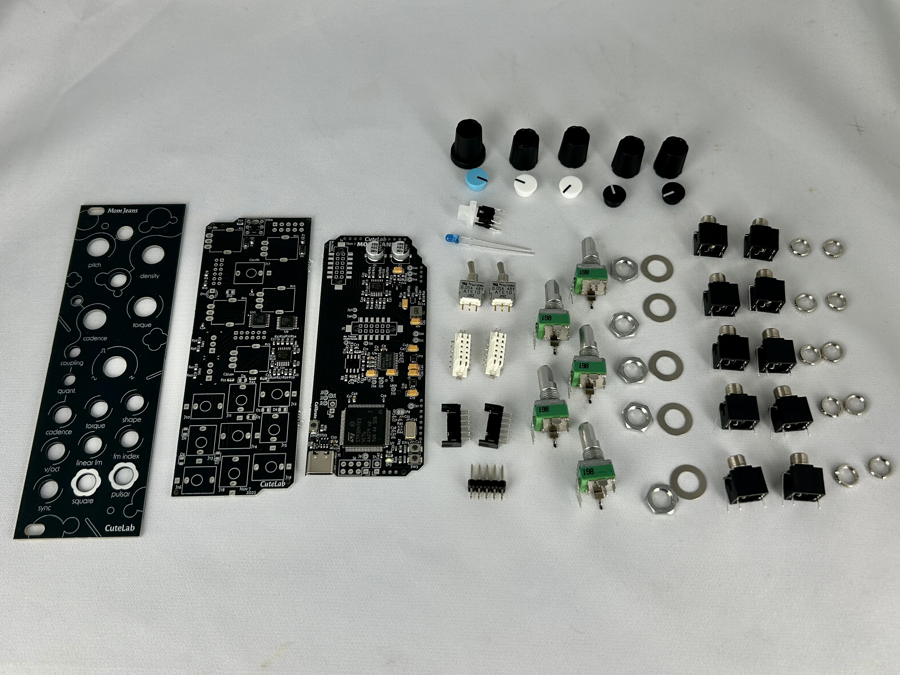

Your kit should contain:

- 1x PCB "mcu" layer
- 1x PCB "control" layer
- 1x front panel
- 1x 2x5 2.54mm pin header
- 2x 2x6 2mm locking pin headers
- 2x 2x6 2mm locking pin sockets
- 2x SPDT toggle switches
- 1x pushbutton LED switch
- 5x 9mm D-shaft potentiometer
- 5x washers & hex nuts for potentiometer
- 10x PJ398 jacks ("Thonkiconn")
- 10x round nuts for jack 
- 1x blue LED
- 1x skirted knob
- 4x unskirted potentiometer knob
- 1x light blue knob cap
- 2x light white knob cap
- 2x light black knob cap
- 1x ribbon cable

> [!NOTE]
> The rear PCB (the little one) may come with the locking pin sockets pre-soldered. If so, you won't find it in the parts bag.


## Building

### 1. Interconnect pin sockets.

> [!NOTE]
> If the rear PCB is pre-soldered, so you can skip this step.

Start with the smaller PCB and the two white pin sockets.

Both sides have a thin ridge in the plastic casing, but only one side has two thin lines in the ridge.

The pin sockets are locking, and have polarity. Those thin lines must fit into the black shrouded headers in step 3.

Make sure the side with the two thin lines is facing towards the top of the PCB.


### 2. Interconnect pin headers.

Next, take the two black shrouded pin headers.

Before soldering, push them onto the sockets on the bottom board. This will ensure the PCBs are properly aligned.

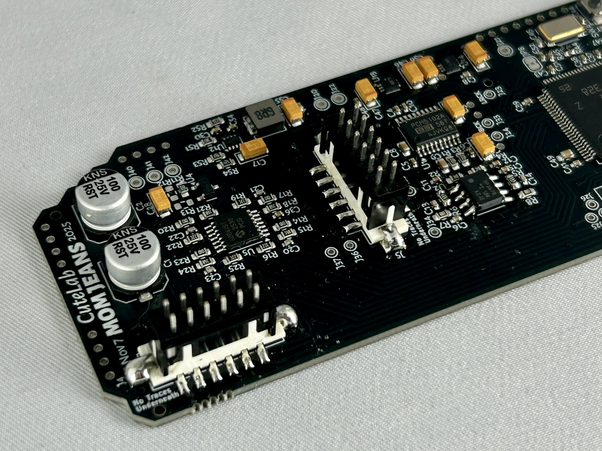
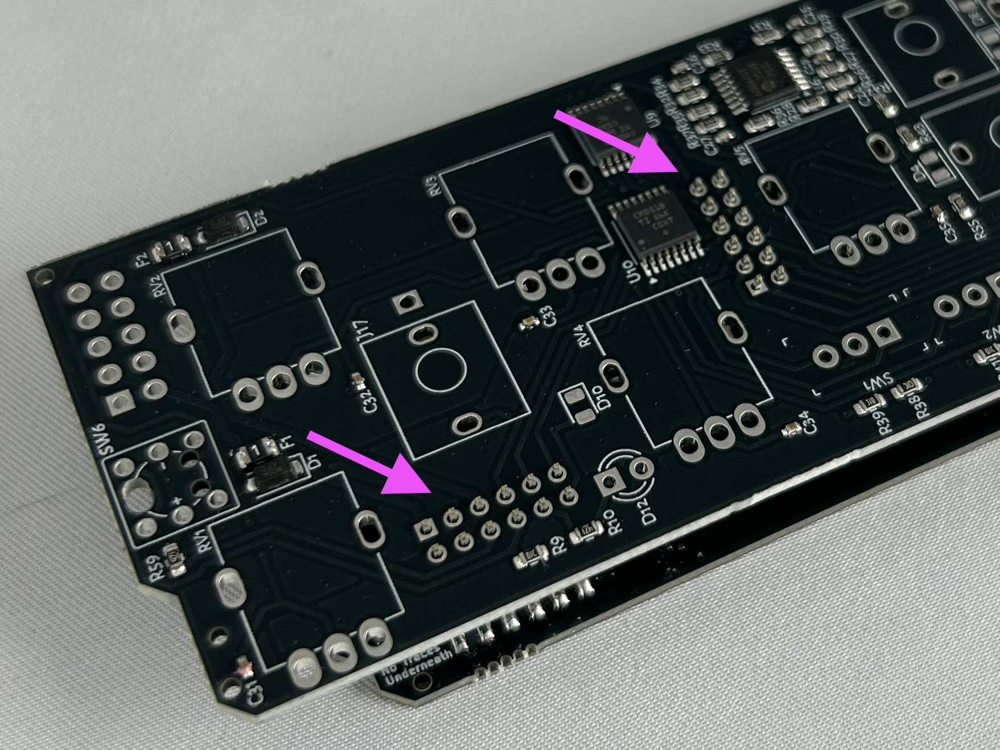

### 3. Solder the power header.

> [!IMPORTANT]
> Make sure to solder the pin header on the correct side.

The power header is the straight connector with 10 positions (two rows of five). The pins are spaced 2.54mm apart.

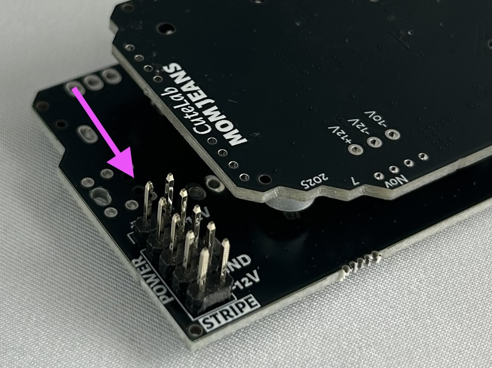


### 5. Fit the pushbutton switches.

> [!IMPORTANT]
> Be careful of orientiaton! These switches include an LED, which has a polarity!

This switch has a "keyed" bottom, with two small circles on one side and a square on the other side. These fit into corresponding holes on the PCB, ensuring the switch fits flush with the panel. Make sure that these extrusions fit fully into the PCB.

The switch also has one pin marked in blue, to show the internal LEDs polarity. But you can ignore this. So long as the keyed bottom is inserted correctly, you can feel assured that the LED orientation is correct.

The switch should stay in place on their own, from the pressure of the pins. We recommend that you don't solder any pins until the panel is fitted, to make sure the button fits correctly.

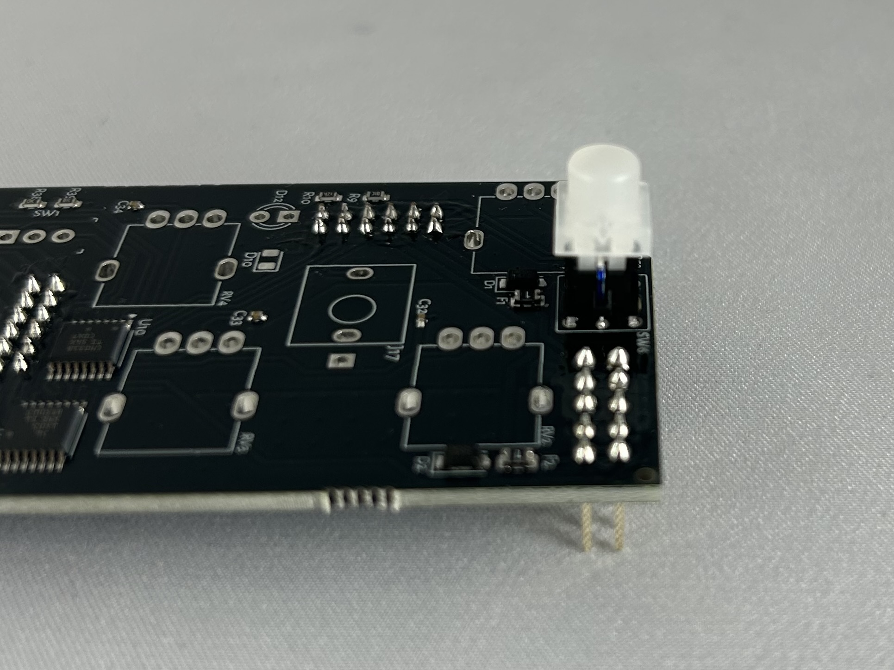
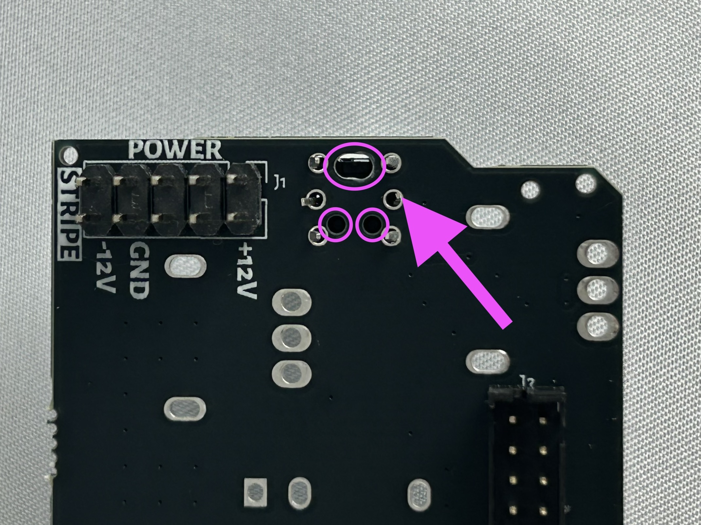

### 6A. Prep the pots.

First, remove any washers and nuts that may be screwed onto the pots.

On the potentiometer, there may be a small stability pin on top. If so, use a pair of pliers to trim it off.  Make sure it's entirely removed, so the panel can sit flat against the pot. Otherwise it can cause other components to be mis-aligned.

### 6B. Fit the pots.

The potentiometers have five pins. The three pins in a row are the ones used for the circuit (the resistance between the pins changes as the pot is turned). The two kinked pins are "mounting" pins, used for physical stability and grounding. If the mounting pins aren't soldered, the pot could cause buzzing every time it's touched.

A small amount force may be necessary when inserting the pot. This is because the mounting pins need to snap into place. You can bend the mounting pins slightly to ensure they fit, but don't straighten them out. They will make assembly easier by holding the pot in position.

As with the button, you can solder one leg of each pot if you like. However, do not solder all pins until later (when the panel is added), or they could turn out very crooked.

### 7. Fit the jacks.

The jacks have three pins. The two smaller pins on the body of the jack fit into the pins in the white box indiicated on the PCB. The longer pin fits into the nearby square hole. When inserting the jack, we find it's easiest to insert the longer pin first, since it has more flexibility.

This part can be a little tricky, because the jacks fit loosely. You might be tempted to solder a pin on each jack to keep them in place. Doing that will keep the jacks flush, but they can still be off-center. So it's best to avoid soldering them until the panel is added.

The two shrouded pin headers should allow you to lay the PCB flat on the table while you insert the jacks.

### 8. Fit the LED.

> [!IMPORTANT]
> Be careful of LED orientation!

LEDs have a polarity, and will not work if connected backwards. Luckily, they won't be damaged if you do, so you can reverse them if you make the mistake. But it's easy to damage the board or parts while fixing the mistake, so it's best to get it right from the start.

The cathode of the LED should be placed in the square hole on the PCB.

The 3mm LEDs that we use have multiple polarity markings. These are show in our [LED Polarity Guide](img/led-polarity-diagram-20240328-2.png). Here's the same info in text form: the flat side of of the casing marks the cathode. The shorter leg also marks the cathode. VERY rarely, an LED is made incorrectly and these don't line up. In that case, you'll need to look at the Anvil and Post inside the case/lens to confirm the polarity.

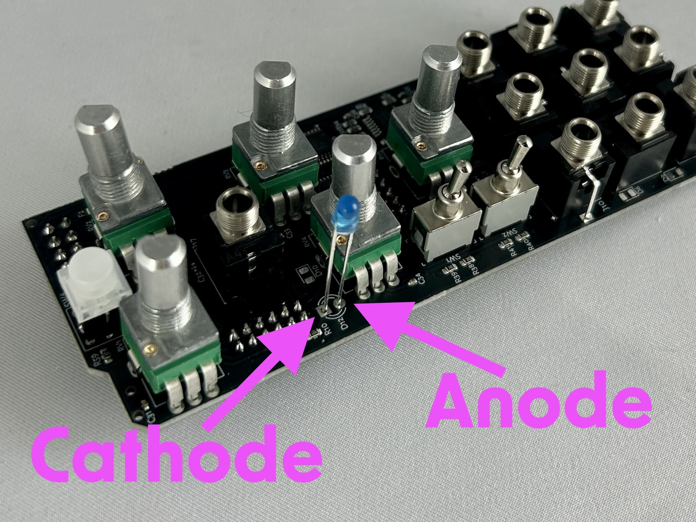

### 8. Fit the panel.

This is probably the hardest part of the build. To make sure that everything lines up perfectly, you want to fit the panel while all the components are still loose. To do this, keep the PCB and panel parallel to the ground. Place the panel over the components, and press down with your thumbs while holding the PCB in place with your other fingers.

Once the panel is at least partially in place, you should be able to hold the panel and PCB together with once hand. Then you can use your other hand to nudge all the components into place.

The panel holes are a bit tight for the "round" and "free" toggle switches. Don't be afraid to use some force to push the panel into place. It should rest flatly across all the jacks.

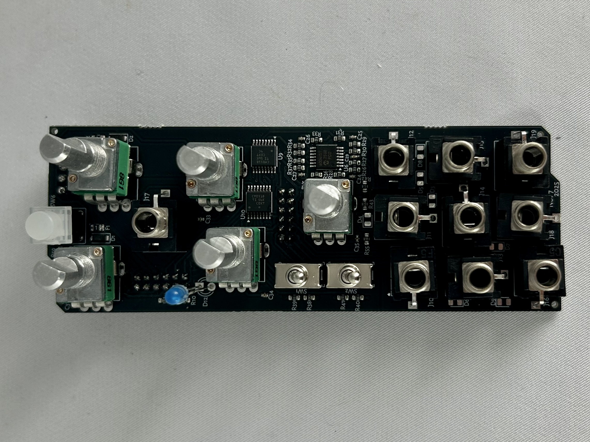
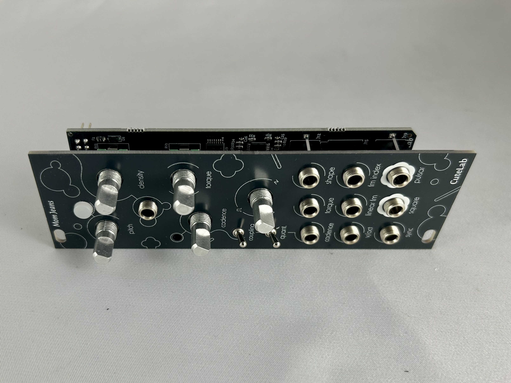

Once the panel is in place, add nuts for a few of the jacks and for the truncate potentiometer. This will be enough to hold everything in place. We recommend these specific nuts:

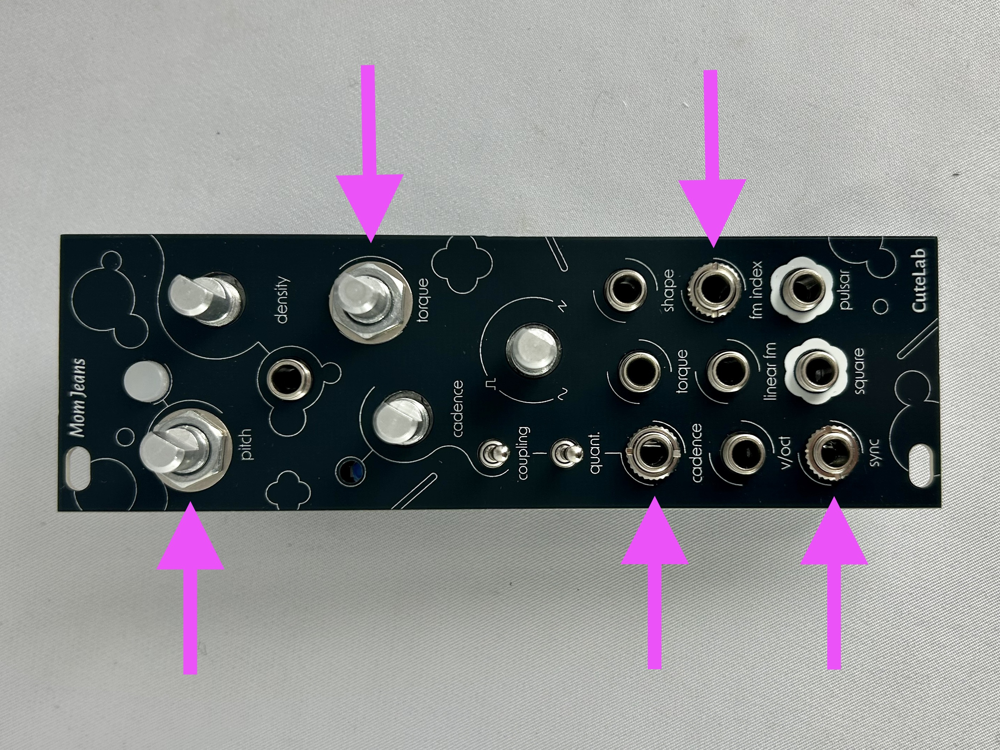


### 9. Solder the controls, jacks, and LED.

With nuts fitted, you can flip over the PCB, allowing the LED to fall into place. Before soldering, make sure each LED is fully seated in its hole.

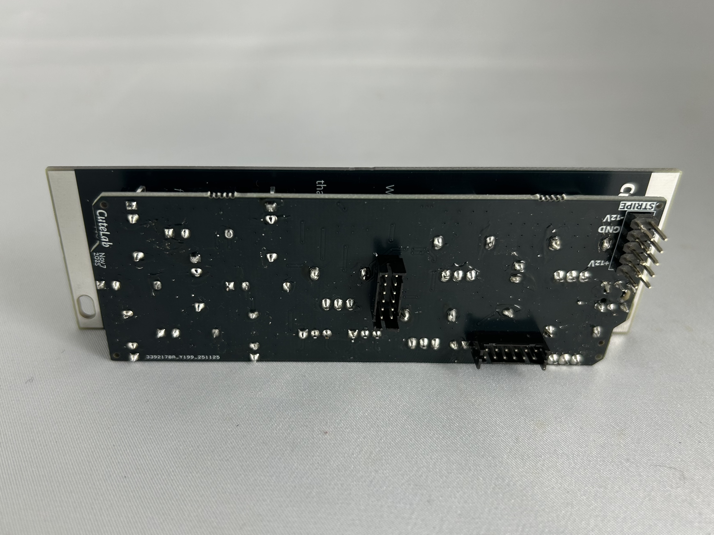

### 12A. Fit the knobs.

The pots are D-shaft, so you simply need to press down on the knobs to fit them. There is only one knob with a "skirt", which is used for the Density control.

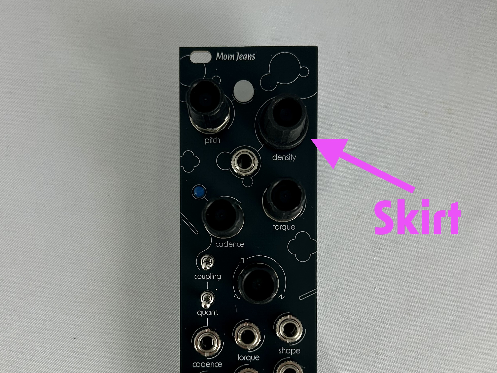

### 12B. Add the caps to the knobs.

First, turn the knobs fully counterclockwise, to where they can't turn any further. Now, press the caps onto the knobs, pointed to the minimum position.

There are small divets in the body of the knob. The indicator on the knob must point between the divets.

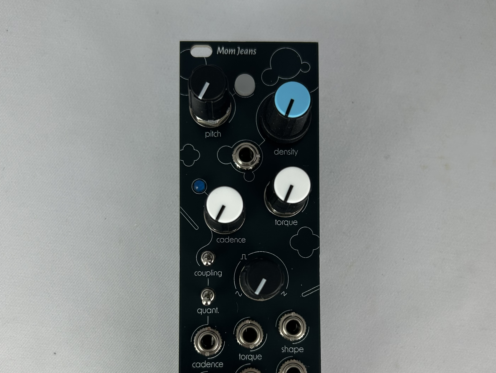

## Work in Progress!!!

Hi sorry we haven't written the DIY kit instructions yet. However, if you order a kit, we promise the instructions will be done by the time your kit arrives.

```
      /`·.¸
     /¸...¸`:·
 ¸.·´  ¸   `·.¸.·´)
: © ):´;      ¸  {
 `·.¸ `·  ¸.·´\`·¸)
     `\\´´\¸.·´
```

## Calibration

How to calibrate your Mom Jeans.